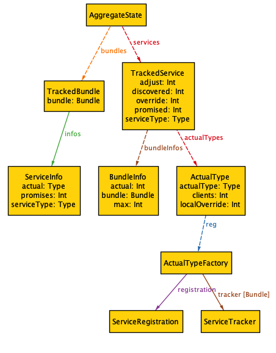

# Aggregate State Revisited

Once of the few really complex problems for well designed systems in OSGi is to prevent the so called 'jojoing' during the initialization
phase. A common cause is the [whiteboard][1] model where the _server_ gets the set of a services of a given _service
type_ that are registered at its activation.  However, just after the server being activated, another _service type_ gets registered. 
To pickup this new service type, the server must be deactivated and then re-activated, causing the jojo effect. 
Dynamic references can handle this but frequently the server requires _all_ plugins to be present from the start before it 
can be registered. Additionally, missing a specific service may create unwanted consequences. For example, think
of a plugin doing auditing.

This solution will inspect all _active_ bundles for the number of service types it _promises_ to register and
then allows a bundle that wants to depend on the set of all promised services types to create an _actual type_
that will only be registered when all the bundles that promised this service type had had a chance to activate their
components. Alternatively, it is possible to _override_ the default mechanism that makes the registration of the
actual type depend on that all bundles have registered their promised services. The override can specify
the absolute number of services registered. This number can be overridden as default for a service type and
per actual type. 

## TL;DR

Provides a solution to pickup the number of service type services that are 'promised' by the installed bundles.
When all the bundles that made promises have been activated and registered the number of their promised services, it will register the 
corresponding actual type services..

This is a template for using this aggregate state:

    @Component
    public class Server {
     
        public interface Plugin {}
   
        public interface PluginAggregate extends Aggregate<Plugin> {}
        
        @Activate
        public Server( @Reference PluginAggregate plugins ) {
            for (Plugin p : plugins) {
               ...
            }
        }

## Other Solutions

There are a number of alternative solutions that can handle or minimize this problem. 

* Startlevels – If you can control start levels you can make sure that the server bundle is started
  later than its plugins. However, this requires a global overview and sometimes the server bundle
  also registers some handlers. Also, some bundles may have an initialization that takes considerable
  time and is done outside the activation.
* Declarative Services Conditions – Conditions provide a gate before a component is activated. This is
  name based. To a certain extent this aggregate state solution is similar, the service that it 
  registers also acts as a gate. The difference is that this solution is type safe and uses 
  the metadata in the bundles to detect when a bundle has registered its promised services.
* [Conditional Target][2] – Specifically designed to address this problem but handles the cardinality of 
  the promised services through configuration. This solution automates the configuration part.
  
## Using the Aggregate 

Given there is a service type `Plugin` that is used in a whiteboard pattern. Then one or more bundles in the system
promise to register one or more Plugin services. The question is, how can we prevent a component from
being activated before all bundles that promise our Plugin service have registered their services?

We first need to create an _actual type_ that can convey the interest in the aggregate of the Plugin services. 
Like:

    interface PluginAggregate extends Aggregate<Plugin> {}

The _actual type_ (in the previous example `PluginAggregate`) is used to record the service type by using it as the generic 
type parameters of `Aggregate<S>`. This generic information is recorded in the class and analyzed by this bundle.

This type must be an interface and it must _directly_ extend the Aggregate type. I.e. it is not sufficient
to extend a class or interface that extends Aggregate, these actual types will be ignored. The generic type parameter
given to the Aggregate type must be the service type, in this case Plugin. The following form is for example wrong:

     // WRONG
    interface Temp<S> extends Aggregate<S> {}
    interface BadPluginAggregate extends Temp<Plugin> {}

The actual type should be local to a declaring class but it can be provided as a public API. Service types that
are aware of the aggregate concept can provide a convenient actual type that is shared by all. For example, this is
a common pattern:

    interface Plugin {
        interface PromisedPlugins extends Aggregate<Plugin> {}
    }

However, declaring the aggregate type as a local implementation type reduces unnecessary coupling in the API
and turns it into an implementation dependency. 

A Server type component can now reference the actual type to get/gate the access to the Plugin services. The Aggregate
server will detect that the Server needs the actual type and it monitors the system to see if all bundles
that promised the corresponding service type have registered their promised bundles. For example, if there are
3 bundles promising to register a Plugin service, the registration of the PluginAggregate will be delayed until
they've actually done so. Once a bundle unregisters one of its promised services, the actual type service,
the Plugin Aggregate service, will be unregistered.

A component can therefore look like the following:

    @Component
    public class ServerImpl implements Server {
        final Collection<Plugin> plugins;
        
        public ServerImpl( @Reference PluginAggregate plugins ) {
            this.plugins = plugins;
        }
    }

The `Aggregate<S>` type extends `Collection<S>` and can be used to access the set of services. However,
this will check out these services and then it is not possible to get access to the properties. Although
the related collection will show new services, there are no callbacks on the discovery of new services.

Another pattern is therefore to use the actual type service as a _gate_ 
only. As long as not all service types are registered, the gate is not there, forbidding the ServerImpl component
from becoming satisfied. When all promised services are registered, then actual gets registered. The Service
Component Runtime will then satisfy the component and activate it with all the service types registered
at that time.

    @Component
    public class ServerImpl implements Server {
        final List<ServiceReference<Plugin>> plugins;
        
        public ServerImpl( @Reference List<ServiceReference<Plugin>> plugins ) {
            this.plugins = plugins;    
        }
        
        @Reference
        Plugin.PromisedPlugins gate;
    }

## Registration Rules

By default, the Aggregate service will count the bundles that promise a service type and when all these
bundles have been activated, registered their promised services, then after short delay the actual type is 
registered. 

For each service type S (e.g. Plugin), the Aggregate Service tracks the following info:

* any bundle that promises to register an S
* set of S registrations
* set of actual types for S (e.g. PluginAggregate)
* an optional override for the number of services

An actual type will register when:

* a actual type local override is set and the number of registered service type services >= than this local override
* a service type override is set and the number of registered service type services >= than this service type override
* all bundles that promised to provide service type services have actually registered them

Bundles that register a service type service but did not promise any are _dynamically discovered_. Their services
count towards the override count but they are ignored for the override checks.

If a bundle registers more than its promised services then this becomes the new promised number. That is,
if a bundle promises to register n instances of S but registers n+1 services then unregistering one
will unregister the actual type until n+1 is reached again.

Registrations are delayed while unregistrations are immediate. Both events are scheduled on another thread
where the actual state is checked just before registering/unregistering.

## Configuration

The following elements are configurable through a number of ways:

* use an override 
* override for the number of services per service type
* registration delay

The configuration for these are defined in order of
increasing priority. 

### @Aggregate annotation

The Aggregate annotation is applied to an actual type and will therefore be able to set the 
_local override_ for the actual type that it is applied to.

### Aggregate-Override Manifest header

The manifest of a bundle records the service references and registrations. These are deduplicated
so that it is not possible to distinguish how many services are promised and how many
actual types are present. Also, in some cases the bundle does not have the proper metadata
and wants to provide it manually. Such bundles can set the Aggregate-Override header.

    Aggregate-Override ::= clause ( ',' clause )
    clause             ::= service-type ( ';' attribute )*
    attribute          ::= promise | actual
    promise            ::= 'promise="' INT '"'
    actual             ::= 'actual="' actual-type ( ',' actual-type )* '"'

The key of this header must be the name of the service type. The following attributes are then
architected:

* `promise=<int>` – The value overrides the number of services that are promised to be registered by this bundle. 
Normally this is found by looking at the `osgi.servce` capabilities for the service type. However, even if there are multiple
  services registered, the manifest will only have one entry. So if more services are registered 
  
* `actual:List<String>=<actual types>` – The value indicates that the given actual types should be registered for 
  this bundle. This will ignore the `osgi.service` reguirements.

For example:

    Aggregate-Override   Plugin;promise=4

Or:

    Aggregate-Override   Plugin;actual="AggregatePlugins,com.example.OtherPlugins"

### System properties 

Both the service type and the actual type can _override_ the required services that should be 
discovered before the actual type service is registered.

In some cases an override is needed because the bundle metadata is not properly set. The override can be
set with the System properties that start with `aggregate.override.` and are suffixed with
a type name.

    System.setProperty( AggregateConstants.PREFIX_TO_OVERRIDE + "Plugin", "3");

If a property is set with the actual type name, it will locally override only for that actual type.
    
    System.setProperty( AggregateConstants.PREFIX_TO_ADJUST + "PluginAggregate", "3");
    
## Bundle Metadata

The service types are found by looking for `osgi.service` _capabilities_. The `objectClass` attribute in this
capability is counted as 1 registered service type. 

    Provide-Capability osgi.service;objectClass:List<String>="Plugin"

Since bnd depublicates the capabilities, it is not possible to find out of more than 1 service is 
registered. The Aggregate service addresses this with a  registration delay to normally should 
pick up other services from the same bundle. In special cases the Aggregate-Override can
set the number of promised services.

The actual type is slightly more complicated. A component that wants to be gated by all installed
services started, can create a new interface that extends `Iterable<S>`, where `S` is a service
type. This bundle scans the bundles and finds any requirement for an actual type.

    public interface PluginAggregate extends Iterable<Plugin> {}

The fact that this `PluginAggregate` service is used in a `@Reference` will force an `osgi.service` requirement. 
This requirement is recorded, assuming bnd, in the manifest in the `Require-Capability` header.

    Require-Capability  osgi.service;filter:="(objectClass=PluginAggregate)"

When the Aggregate service analyzes this header, it checks if the object class extends `Aggregate`.
Although Java erases much of the generics, it maintains the generic information for extended interfaces. 
This enables the bundle to find that the  constituent class is `Plugin`, called the _service type_. 
       
Therefore, after analyzing the bundle we can establish the following information for each service type:

* the service type
* a list of actual types
* promised services per bundle
* discovered services (registered)

The following is the design model:

The Service Tracker keeps track of the registered services for the service type. It records
the bundles that have properly registered all the promised services and the total number of
services.

However, the registration takes place on the actual type. It is the Actual Type that decides
when to register. This allows a local override for each actual type.

An Actual Type is _satisfied_ when

        override >= 0 ?  
             (local) override <= actual 
        :    all b : BundleInfo | b.satisfied

A Bundle Info records the promised services and tracks the registered services. It can be
created through two different means;

* When a new service is registered and there is not yet a Bundle Info. This can happen
  because a bundle might be activated, and register services, before the Aggregate service
  has seen it. This is a dynamically detected Bundle Info.
* When a new ACTIVE bundle is detected, this is a _statically detected_ Bundle Info. If there
  was already a dynamically detected Bundle Info, it is set to statically detected.
  
In some cases the bundle promises fewer services than it actually registers. If this happens,
the promises are updated to reflect the new number. This means that if a bundle promises
1 service but registers 6 and then unregisters one, leaving 5, it will become
unsatisfied. 

A Bundle Info is satisfied if the actual >= promised. 

When the Actual Type is satisfied it will register a Service Factory of the actual type on 
a separate thread outside the Aggregate state lock. When a bundle requests an instance,
a proxy is created that implements the actual type. Since the Aggregate<S> implements
all the methods of Collection<S>, the methods are redirected to a Service Tracker's
tracked services. This service tracker is created on demand and uses the calling 
bundle's context. 

When the Actual Type becomes unsatisfied, the Service Factory is immediately scheduled to be
unregistered. Any created Service Trackers are closed.

The actual implementation also needs to handle that multiple bundles
can use the same actual type, it implements reference counting in the ActualType for this.

[1]: https://enroute.osgi.org/FAQ/400-patterns.html#whiteboard-pattern
[2]: https://github.com/aQute-os/biz.aQute.osgi.util/tree/master/biz.aQute.osgi.conditionaltarget
